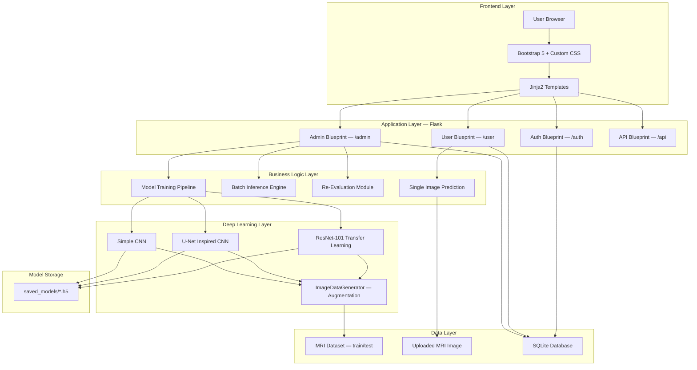
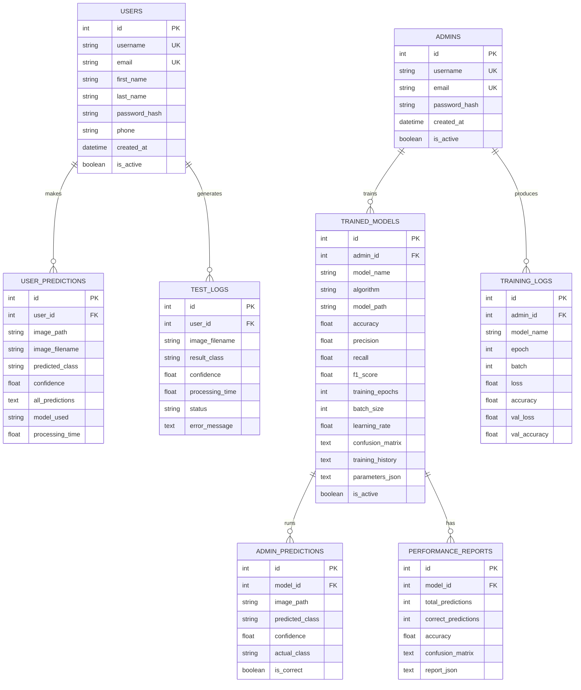

# Alzheimer Disease Prediction System — Interview-Ready Project Documentation

> **IoMT & Deep Learning Integration for Healthcare 5.0**

---

## 1. Project Title

**Alzheimer Disease Prediction System Using MRI Brain Scan Analysis with Deep Learning & IoMT**

---

## 2. Domain

**Healthcare / Medical AI / Internet of Medical Things (IoMT) / Deep Learning / Image Classification**

---

## 3. Problem Statement

Alzheimer's Disease is a progressive neurological disorder that causes brain cell degeneration and cognitive decline. Early detection is critical because the disease is irreversible once it progresses beyond mild stages. Manual analysis of MRI brain scans by radiologists is time-consuming, subject to human error, and not scalable in regions with limited healthcare infrastructure. There is a pressing need for an **automated, intelligent system** that can analyze MRI brain scans and classify the stage of dementia with high accuracy, enabling timely intervention and treatment planning.

---

## 4. Objective

- Build a web-based system that accepts MRI brain scan images and predicts the Alzheimer's disease stage.
- Classify scans into **4 categories**: Non-Demented, Very Mild Demented, Mild Demented, and Moderate Demented.
- Provide an **admin-controlled model training pipeline** where multiple deep learning architectures can be trained, evaluated, and compared.
- Enable **users (clinicians/patients)** to upload MRI images and receive instant predictions with confidence scores.
- Track all predictions, training logs, and model performance metrics in a centralized database.

---

## 5. Real-World Use Case

| Stakeholder                | Use Case                                                                                   |
| -------------------------- | ------------------------------------------------------------------------------------------ |
| **Hospitals & Clinics**    | Radiologists use the system as a second-opinion tool for faster MRI analysis               |
| **Elderly Care Homes**     | Periodic screening of residents for early cognitive decline detection                      |
| **Telemedicine Platforms** | Remote MRI analysis for underserved regions without specialist radiologists                |
| **Research Labs**          | Comparing deep learning model architectures (ResNet-101, U-Net, CNN) on Alzheimer MRI data |
| **Health IoMT Networks**   | MRI devices push scans to the prediction API for automated triage                          |

---

## 6. Technologies Used

| Layer                | Technologies                                                                                            |
| -------------------- | ------------------------------------------------------------------------------------------------------- |
| **Backend**          | Python 3.12, Flask 2.3+, Flask-SQLAlchemy, Flask-Session                                                |
| **Deep Learning**    | TensorFlow 2.16+, Keras 3.0+, ResNet-101 (Transfer Learning), U-Net (Segmentation-Inspired), Custom CNN |
| **Image Processing** | OpenCV 4.8+, Pillow 10.0+                                                                               |
| **Data Science**     | NumPy 1.24+, Pandas 2.0+, scikit-learn 1.3+, Matplotlib 3.7+                                            |
| **Database**         | SQLite (via SQLAlchemy ORM)                                                                             |
| **Frontend**         | HTML5, CSS3 (Custom Design System with Dark Mode), Bootstrap 5, JavaScript (AJAX)                       |
| **Authentication**   | Werkzeug password hashing (PBKDF2-SHA256)                                                               |
| **Session Mgmt**     | Server-side filesystem sessions (Flask-Session)                                                         |
| **DevOps**           | Virtual environment (venv), batch/shell startup scripts                                                 |

---

## 7. System Architecture

The system follows a **layered MVC architecture** with Flask's application factory pattern:



### Step-by-Step Flow

1. **Application Factory** ([**init**.py](file:///d:/Ahmed/Project_3/Alzheimer%20Disease%20Prediction/app/__init__.py)): `create_app()` initializes Flask, loads config, initializes SQLAlchemy, registers 4 blueprints, and creates database tables.
2. **Configuration** ([config.py](file:///d:/Ahmed/Project_3/Alzheimer%20Disease%20Prediction/app/config.py)): Environment-specific configs (dev/prod/test) define database URI, upload limits (50MB), session lifetime (24h), and model/dataset paths.
3. **Authentication** ([auth.py](file:///d:/Ahmed/Project_3/Alzheimer%20Disease%20Prediction/app/routes/auth.py)): Two separate authentication flows — User login/register & Admin login — with `@login_required` and `@admin_login_required` decorators.
4. **Admin Training** ([admin.py](file:///d:/Ahmed/Project_3/Alzheimer%20Disease%20Prediction/app/routes/admin.py)): Admin selects algorithm, epochs, batch size, learning rate → `DataLoader` loads MRI images → model trains → evaluation metrics saved to DB → `.h5` file saved.
5. **User Prediction** ([user.py](file:///d:/Ahmed/Project_3/Alzheimer%20Disease%20Prediction/app/routes/user.py)): User uploads MRI image → image preprocessed (grayscale → resize 224×224 → BGR → normalize) → loaded active model predicts → results stored with confidence scores.
6. **API Layer** ([api.py](file:///d:/Ahmed/Project_3/Alzheimer%20Disease%20Prediction/app/routes/api.py)): RESTful endpoints for health check, model stats, and prediction stats.

---

## 8. Data Flow Explanation

```mermaid
flowchart LR
    A[MRI Image Upload] --> B[Read as bytes]
    B --> C[Decode with OpenCV]
    C --> D[Convert to Grayscale]
    D --> E[Resize to 224×224]
    E --> F[Convert GRAY → BGR 3-channel]
    F --> G[Normalize to 0-1 float32]
    G --> H[Expand dims for batch]
    H --> I[Load Active Model .h5]
    I --> J[model.predict]
    J --> K[argmax → Class Label]
    K --> L[Save to DB + Return JSON]
```



### Training Data Flow

1. `DataLoader` scans `Dataset/train/` and `Dataset/test/` directories
2. Reads images from 4 class-named subfolders: `NonDemented`, `VeryMildDemented`, `MildDemented`, `ModerateDemented`
3. Each image: read as grayscale → resize 224×224 → convert to 3-channel BGR → normalize to [0, 1]
4. `ImageDataGenerator` applies real-time augmentation: rotation ±20°, width/height shift 20%, horizontal flip, zoom 20%
5. Model trains on augmented data with validation on test set

---

## 9. Folder Structure Explanation

```
Alzheimer Disease Prediction/
├── app/                          # Flask application package
│   ├── __init__.py              # App factory — create_app()
│   ├── config.py                # Dev/Prod/Test configurations
│   ├── models.py                # 8 SQLAlchemy ORM models
│   ├── routes/                  # Blueprint route handlers
│   │   ├── auth.py              # Login, Register, Logout
│   │   ├── admin.py             # Train, Inference, Reports
│   │   ├── user.py              # Upload, Predict, Results
│   │   └── api.py               # REST API endpoints
│   ├── templates/               # Jinja2 HTML templates
│   │   ├── base.html            # Master layout
│   │   ├── navbar.html          # Navigation with theme toggle
│   │   ├── login.html           # User login form
│   │   ├── register.html        # Registration form
│   │   ├── admin_login.html     # Admin login form
│   │   ├── admin/               # 8 admin templates
│   │   └── user/                # 6 user templates
│   ├── static/css/style.css     # Design system (light + dark mode)
│   └── uploads/                 # User-uploaded MRI images
├── models/                      # Deep Learning module
│   └── deep_learning.py         # DataLoader, ResNet101, UNet, SimpleDL
├── Dataset/                     # MRI image dataset
│   ├── train/                   # Training images (4 class folders)
│   └── test/                    # Testing images (4 class folders)
├── saved_models/                # Persisted .h5 trained models
├── instance/                    # SQLite database file
├── flask_session/               # Server-side session storage
├── run.py                       # Application entry point
├── setup.py                     # Database initialization script
├── re_evaluate.py               # Batch re-evaluation utility
├── requirements.txt             # Python dependencies
├── start.bat                    # Windows startup script
└── start.sh                     # Linux/Mac startup script
```

---

## 10. Key Modules and Their Responsibilities

| Module              | File                      | Responsibility                                                                                                    |
| ------------------- | ------------------------- | ----------------------------------------------------------------------------------------------------------------- |
| **App Factory**     | `app/__init__.py`         | Creates Flask app, registers blueprints, initializes DB, configures session                                       |
| **Configuration**   | `app/config.py`           | Environment-specific settings (DB URI, upload limits, model paths)                                                |
| **Database Models** | `app/models.py`           | 8 ORM models: User, Admin, TrainedModel, UserPrediction, AdminPrediction, TrainingLog, TestLog, PerformanceReport |
| **Auth Routes**     | `app/routes/auth.py`      | User/Admin registration, login, logout with decorator-based access control                                        |
| **Admin Routes**    | `app/routes/admin.py`     | Model training, inference, re-evaluation, performance reports, confusion matrix retrieval                         |
| **User Routes**     | `app/routes/user.py`      | MRI upload, prediction, results history, chart data, test logs, profile management                                |
| **API Routes**      | `app/routes/api.py`       | Health check, model statistics, prediction statistics (RESTful JSON)                                              |
| **Deep Learning**   | `models/deep_learning.py` | `DataLoader`, `ResNet101Model`, `UNetModel`, `SimpleDLModel` with train/predict/evaluate/save/load lifecycle      |
| **Re-Evaluation**   | `re_evaluate.py`          | CLI utility to re-evaluate all saved models on test dataset and update DB metrics                                 |
| **Setup**           | `setup.py`                | One-time database initialization and default admin/demo user creation                                             |

---

## 11. Algorithms / Models Used

### 1. ResNet-101 with Transfer Learning _(Primary Model)_

| Attribute        | Detail                                                                                                                                                                                                       |
| ---------------- | ------------------------------------------------------------------------------------------------------------------------------------------------------------------------------------------------------------ |
| **Architecture** | ResNet-101 pre-trained on ImageNet (frozen base) + GlobalAveragePooling2D + Dense(1024, ReLU) + Dropout(0.5) + Dense(512, ReLU) + Dropout(0.3) + Dense(4, Softmax)                                           |
| **Optimizer**    | Adam (lr=0.0001)                                                                                                                                                                                             |
| **Loss**         | Sparse Categorical Crossentropy                                                                                                                                                                              |
| **Why Chosen**   | Transfer learning leverages 44M+ parameters pre-trained on 1.2M images; ideal for medical imaging where labeled data is limited. ResNet's skip connections solve vanishing gradient problem in deep networks |

### 2. U-Net Inspired CNN _(Segmentation-to-Classification Adaptation)_

| Attribute        | Detail                                                                                                                                                                                                  |
| ---------------- | ------------------------------------------------------------------------------------------------------------------------------------------------------------------------------------------------------- |
| **Architecture** | Encoder: Conv2D(32) → MaxPool → Conv2D(64) → MaxPool → Conv2D(128) → MaxPool → Conv2D(256) + GlobalAveragePooling2D + Dense(128) + Dropout(0.5) + Dense(64) + Dropout(0.3) + Dense(4, Softmax)          |
| **Optimizer**    | Adam (lr=0.001)                                                                                                                                                                                         |
| **Why Chosen**   | U-Net's encoder extracts hierarchical spatial features from MRI scans; the multi-scale feature extraction captures both fine-grained textures and broader structural patterns relevant to brain atrophy |

### 3. Simple CNN _(Baseline Model)_

| Attribute        | Detail                                                                                                                                       |
| ---------------- | -------------------------------------------------------------------------------------------------------------------------------------------- |
| **Architecture** | 4× Conv2D+MaxPool blocks (32→64→128→256 filters) → Flatten → Dense(512) + Dropout(0.5) + Dense(256) + Dropout(0.3) + Dense(4, Softmax)       |
| **Optimizer**    | Adam (lr=0.001)                                                                                                                              |
| **Why Chosen**   | Lightweight baseline for comparison; trains faster with fewer parameters; helps validate that transfer learning provides genuine improvement |

### Data Augmentation (Applied to All Models)

- Rotation: ±20°
- Width/Height shift: 20%
- Horizontal flip: enabled
- Zoom: 20%

> **Rationale**: Augmentation prevents overfitting on small medical datasets and simulates variations in MRI scan orientation/positioning.

---

## 12. Database Schema



---

## 13. API Endpoints

| Method     | Endpoint                       | Auth  | Description                                         |
| ---------- | ------------------------------ | ----- | --------------------------------------------------- |
| `GET`      | `/`                            | —     | Redirects to user/admin dashboard or login          |
| `GET/POST` | `/auth/register`               | —     | User registration                                   |
| `GET/POST` | `/auth/login`                  | —     | User login                                          |
| `GET/POST` | `/auth/admin-login`            | —     | Admin login                                         |
| `GET`      | `/auth/logout`                 | —     | User logout                                         |
| `GET`      | `/auth/admin-logout`           | —     | Admin logout                                        |
| `GET`      | `/admin/dashboard`             | Admin | Admin dashboard with model stats                    |
| `GET`      | `/admin/dataset-details`       | Admin | View dataset class distribution                     |
| `GET/POST` | `/admin/train-model`           | Admin | Train new model (algorithm, epochs, batch_size, lr) |
| `GET`      | `/admin/models`                | Admin | List all trained models                             |
| `GET`      | `/admin/model/<id>`            | Admin | Model detail view                                   |
| `POST`     | `/admin/toggle-model/<id>`     | Admin | Activate/deactivate model                           |
| `POST`     | `/admin/re-evaluate/<id>`      | Admin | Re-evaluate model on test dataset                   |
| `GET/POST` | `/admin/run-inference`         | Admin | Batch inference on test data                        |
| `GET`      | `/admin/performance-reports`   | Admin | View all model performance reports                  |
| `GET`      | `/admin/confusion-matrix/<id>` | Admin | Get confusion matrix JSON                           |
| `GET`      | `/admin/training-logs`         | Admin | View training logs                                  |
| `GET`      | `/admin/api/training-logs`     | Admin | Training logs JSON API                              |
| `GET`      | `/user/dashboard`              | User  | User dashboard                                      |
| `GET`      | `/user/profile`                | User  | View profile                                        |
| `POST`     | `/user/edit-profile`           | User  | Update profile                                      |
| `GET/POST` | `/user/test-data`              | User  | Upload MRI & get prediction                         |
| `GET`      | `/user/results`                | User  | Prediction history                                  |
| `GET`      | `/user/results-charts`         | User  | Visual charts of predictions                        |
| `GET`      | `/user/test-logs`              | User  | Test execution logs                                 |
| `GET`      | `/user/api/chart-data`         | User  | Chart data JSON                                     |
| `GET`      | `/api/health`                  | —     | Health check                                        |
| `GET`      | `/api/models/stats`            | —     | Model statistics                                    |
| `GET`      | `/api/predictions/stats`       | —     | Prediction statistics                               |

---

## 14. My Role & Contribution

I was the **sole developer** of this project, responsible for the entire system from design to deployment:

- **Designed the system architecture** — Application factory pattern with Flask blueprints for clean separation of admin and user modules.
- **Implemented three deep learning models** — Built ResNet-101 transfer learning, U-Net-inspired CNN, and a baseline CNN from scratch using TensorFlow/Keras; each with complete train, predict, evaluate, save, and load lifecycles.
- **Developed the MRI preprocessing pipeline** — Handled grayscale conversion, resizing to 224×224, BGR channel expansion (required by ResNet), float32 normalization, and real-time data augmentation.
- **Built the full-stack web application** — Created role-based portals for Admin (train models, run inference, view confusion matrices, toggle active model) and User (upload MRI, get predictions, view history/charts).
- **Designed the database schema** — 8 normalized SQLAlchemy models with proper relationships, cascading deletes, and JSON serialization for confusion matrices and training histories.
- **Implemented security measures** — Password hashing with Werkzeug (PBKDF2), session management, input validation, decorator-based route protection, and secure file uploads.
- **Created the CSS design system** — Full light/dark theme with CSS custom properties, smooth transitions, responsive layouts, gradient accents, and hover micro-animations.
- **Wrote deployment automation** — Startup scripts for Windows/Linux that handle virtual environment creation, dependency installation, database initialization, and application launch.

---

## 15. Challenges Faced & Practical Solutions

| Challenge                                                                         | Solution                                                                                                                                             |
| --------------------------------------------------------------------------------- | ---------------------------------------------------------------------------------------------------------------------------------------------------- |
| **Class imbalance in Alzheimer dataset** (ModerateDemented has far fewer samples) | Applied aggressive data augmentation (rotation, shift, flip, zoom) via `ImageDataGenerator` to synthetically balance training distribution           |
| **ResNet-101 requires 3-channel input but MRI scans are grayscale**               | Implemented grayscale→BGR conversion (`cv2.cvtColor(img, cv2.COLOR_GRAY2BGR)`) to create 3-channel input compatible with ImageNet-pretrained weights |
| **Large model files (~200MB each) causing slow predictions**                      | Implemented active model toggling — only one model loaded per prediction request; used `is_active` flag to avoid loading all models                  |
| **Overfitting on small medical dataset**                                          | Froze ResNet-101 base layers (transfer learning), added Dropout(0.5, 0.3), and used augmentation to regularize                                       |
| **Model evaluation metrics becoming stale after dataset changes**                 | Built `re_evaluate.py` utility to batch re-evaluate all saved models on current test data and update DB metrics                                      |
| **Error tracking for user uploads**                                               | Implemented `TestLog` model that records both success and failure cases with error messages for debugging                                            |
| **Thread-safety with TensorFlow**                                                 | Configured `use_reloader=False` in Flask run to avoid TensorFlow multi-thread initialization issues                                                  |

---

## 16. Performance Metrics

| Metric               | Description                                     | How Measured                                                                |
| -------------------- | ----------------------------------------------- | --------------------------------------------------------------------------- |
| **Accuracy**         | Overall correct predictions / total predictions | `sklearn.metrics.accuracy_score`                                            |
| **Precision**        | Weighted average precision across 4 classes     | `classification_report(..., output_dict=True)['weighted avg']['precision']` |
| **Recall**           | Weighted average recall across 4 classes        | `classification_report(...)['weighted avg']['recall']`                      |
| **F1-Score**         | Weighted harmonic mean of precision and recall  | `classification_report(...)['weighted avg']['f1-score']`                    |
| **Confusion Matrix** | 4×4 matrix showing per-class predictions        | `sklearn.metrics.confusion_matrix(y_test, pred_labels, labels=[0,1,2,3])`   |
| **Processing Time**  | Time from image upload to prediction return     | `time.time()` delta, stored in `UserPrediction.processing_time`             |

> All metrics are computed on the test dataset and persisted in the `TrainedModel` table for each trained model. Admins can compare models via the performance reports page.

---

## 17. Scalability Considerations

- **Multiple Model Architecture Support** — New model classes (e.g., VGG16, EfficientNet) can be added to `deep_learning.py` and plugged into the training pipeline by algorithm name.
- **Active Model Toggling** — Only one model is active at a time for predictions, making it easy to A/B test or roll back.
- **Blueprint Architecture** — Each module (auth, admin, user, api) is a separate Flask blueprint; new modules can be added without modifying existing code.
- **Database Abstraction** — SQLAlchemy ORM allows switching from SQLite to PostgreSQL/MySQL by changing one configuration string.
- **Configurable Training Params** — Epochs, batch size, and learning rate are user-configurable per training session.
- **RESTful API** — The `/api` blueprint provides JSON endpoints that can serve mobile apps or IoMT device integrations.

---

## 18. Security Considerations

| Aspect                     | Implementation                                                                                      |
| -------------------------- | --------------------------------------------------------------------------------------------------- |
| **Password Storage**       | Werkzeug `generate_password_hash` (PBKDF2-SHA256), never stored in plaintext                        |
| **Route Protection**       | `@login_required` and `@admin_login_required` decorators verify session tokens                      |
| **Session Management**     | Server-side filesystem sessions (not client cookies), 24-hour expiration                            |
| **File Upload Validation** | Extension whitelist (`jpg, jpeg, png, gif, bmp`), 50MB size limit, `secure_filename()` sanitization |
| **CSRF Protection**        | Session-based form handling, JSON request validation                                                |
| **Role Separation**        | Admin and User are separate database tables with separate login flows and session keys              |
| **Input Validation**       | Server-side field validation for registration, duplicate checks for username/email                  |

---

## 19. Limitations

1. **No Real-Time Collaboration** — Single-admin model management; no multi-admin concurrent training support.
2. **SQLite Database** — Not suitable for high-concurrency production workloads; would need PostgreSQL migration.
3. **No GPU Auto-Detection** — Training relies on CPU if CUDA is not configured; no GPU optimization flags.
4. **No Model Versioning** — Models are saved as `.h5` files with timestamps, but there is no proper MLOps versioning (no MLflow, no DVC).
5. **No GradCAM/Explainability** — Predictions return confidence scores but do not visualize which brain regions influenced the classification.
6. **Single-Image Prediction** — The user portal handles one image at a time; no bulk/batch prediction for users.
7. **No Automated Retraining** — Model training is manually triggered by the admin.
8. **No Email/SMS Alerts** — No notification system for critical predictions (e.g., Moderate Demented).

---

## 20. Future Improvements

1. **GradCAM Visualization** — Highlight brain regions the model focuses on, improving clinical interpretability.
2. **PostgreSQL + Redis** — Migrate to production database with Redis-backed session and caching.
3. **Celery Task Queue** — Offload model training to background workers to avoid HTTP request timeouts.
4. **REST API Authentication** — Add JWT/OAuth2 tokens for the API layer to support mobile and IoMT integrations.
5. **Docker + Kubernetes** — Containerize the application for cloud deployment and horizontal scaling.
6. **Federated Learning** — Enable hospitals to collaboratively train models without sharing patient data.
7. **DICOM Support** — Accept standard medical imaging format (DICOM) directly from MRI machines.
8. **Automated Model Retraining** — Trigger retraining when new labeled data is added to the dataset.
9. **Multi-Language Support** — Localize the UI for regional healthcare providers.
10. **Progressive Web App (PWA)** — Enable offline-capable mobile access for field clinicians.

---

## 21. Deployment Details

| Component               | Detail                                                                         |
| ----------------------- | ------------------------------------------------------------------------------ |
| **Entry Point**         | `run.py` — starts Flask on `0.0.0.0:5000`                                      |
| **Startup Scripts**     | `start.bat` (Windows), `start.sh` (Linux/Mac)                                  |
| **Startup Flow**        | Create venv → Install dependencies → Initialize DB (if needed) → Run Flask app |
| **Default Credentials** | Admin: `admin / admin123`, Demo User: `demo / demo123`                         |
| **Database**            | Auto-created SQLite at `instance/alzheimer_db.db`                              |
| **Model Storage**       | `.h5` files in `saved_models/` directory                                       |
| **Session Storage**     | Server-side filesystem in `flask_session/`                                     |
| **Environment**         | Configurable via `FLASK_ENV` env variable (development/production/testing)     |

---

## 22. How This Project is Different

| Feature                 | Typical Academic Projects       | This Project                                                               |
| ----------------------- | ------------------------------- | -------------------------------------------------------------------------- |
| **Model Training**      | Jupyter notebook, single model  | Web-based admin panel, 3 architectures, configurable hyperparams           |
| **Model Management**    | No persistence                  | Active model toggling, re-evaluation, performance comparison dashboard     |
| **User Interface**      | Script output / basic Streamlit | Full-stack Flask app with role-based portals, dark mode, responsive design |
| **Prediction Pipeline** | Single script                   | End-to-end: upload → preprocess → predict → store → visualize with charts  |
| **Logging**             | None                            | TrainingLog, TestLog, PerformanceReport tables with full audit trail       |
| **Security**            | None                            | Password hashing, session management, route decorators, file validation    |
| **Deployment**          | Manual                          | One-click startup scripts with auto-setup                                  |
| **Architecture**        | Monolithic notebook             | Application factory, blueprints, ORM, MVC separation                       |

---

## 23. 2-Minute Interview Explanation Script

> _"I built an Alzheimer Disease Prediction System that analyzes MRI brain scans using deep learning to classify the stage of dementia into four categories: Non-Demented, Very Mild, Mild, and Moderate Demented._
>
> _The system has two main portals — an Admin portal and a User portal. The admin can train deep learning models directly from the web interface by selecting from three architectures: ResNet-101 with transfer learning, a U-Net-inspired CNN, or a simple baseline CNN. The admin can configure hyperparameters like epochs, batch size, and learning rate. After training, the system evaluates the model on test data and stores all metrics including accuracy, precision, recall, F1-score, and the confusion matrix._
>
> _The user portal allows clinicians to upload MRI images and get instant predictions with confidence scores. Each prediction is logged for audit purposes, and users can view their history with visual charts._
>
> _On the technical side, I used Flask with an application factory pattern and blueprints for clean architecture, SQLAlchemy with 8 database models for data persistence, and TensorFlow/Keras for the deep learning pipeline. I handled challenges like class imbalance through data augmentation, the grayscale-to-3-channel conversion needed for ResNet, and built a re-evaluation utility so the admin can update model metrics without retraining._
>
> _This project demonstrates my skills in full-stack development, deep learning model design, database design, image processing, and building production-quality systems for healthcare applications."_

---

## 24. 5-Minute Technical Deep Explanation

> _"Let me walk you through the complete architecture and technical decisions behind my Alzheimer Disease Prediction System._
>
> **Architecture & Design Patterns**
>
> _I used Flask's Application Factory pattern — the `create_app()` function in `app/__init__.py` initializes everything: loads environment-specific configuration, initializes SQLAlchemy, sets up server-side sessions, and registers four Flask Blueprints — Auth, Admin, User, and API. This separation makes the codebase modular and testable._
>
> **Database Design**
>
> _I designed 8 SQLAlchemy models. The key ones are `TrainedModel` which stores the algorithm type, hyperparameters, file path to the .h5 model, and all evaluation metrics including a JSON-serialized confusion matrix and training history. `UserPrediction` stores each prediction with the image filename, predicted class, confidence score, all class probabilities as JSON, the specific model used, and the processing time. I also built `TrainingLog` and `TestLog` for audit trails._
>
> **Deep Learning Pipeline**
>
> _The core is in `models/deep_learning.py`. I built three model architectures:_
>
> _First, **ResNet-101 with Transfer Learning** — I load the pre-trained ImageNet weights, freeze all base layers to preserve learned features, then add a custom classification head: GlobalAveragePooling2D → Dense(1024, ReLU) → Dropout(0.5) → Dense(512, ReLU) → Dropout(0.3) → Dense(4, Softmax). The low learning rate of 0.0001 ensures fine-tuning doesn't destroy pre-trained features._
>
> _Second, a **U-Net-inspired CNN** — I adapted the U-Net encoder path with four convolutional blocks (32→64→128→256 filters) followed by GlobalAveragePooling and a classification head. The multi-scale feature extraction captures both fine textures and structural brain patterns._
>
> _Third, a **Simple CNN** as a baseline with four Conv2D+MaxPool blocks and a fully connected classifier._
>
> **Image Preprocessing**
>
> _MRI scans are grayscale, but ResNet-101 expects 3-channel RGB input. So my preprocessing pipeline reads images as grayscale, resizes to 224×224, converts grayscale to BGR using OpenCV's `cvtColor`, normalizes to [0, 1] float32, and expands dimensions for batch input. For training, I apply real-time augmentation — rotation, shifts, flips, and zoom — to combat overfitting on a relatively small medical dataset._
>
> **Active Model Management**
>
> _A key design decision was the active model system. The admin can train multiple models and toggle which one is active for user predictions. When a model is activated, all others are deactivated — this creates a clean single-model prediction pipeline without loading multiple models into memory. I also built a `re_evaluate.py` utility that loads each saved .h5 file, runs predictions on the current test dataset, and updates the database metrics — useful when the dataset changes or to verify model integrity._
>
> **Security**
>
> _Passwords are hashed with Werkzeug's PBKDF2-SHA256. Routes are protected with custom decorators that check session tokens. File uploads are validated for extensions and size. Admin and User are separate database tables with separate session keys, so even if a user's session is compromised, it cannot access admin routes._
>
> **Frontend**
>
> _I built a custom CSS design system with CSS custom properties supporting both light and dark themes. The theme toggle uses JavaScript to swap a `data-theme` attribute, and all colors cascade through CSS variables. The admin pages include dynamic charts built with JavaScript for confusion matrix visualization and training history graphs."_

---

## 25. Technical Interview Questions & Answers

### Q1: Why did you choose ResNet-101 over simpler architectures for MRI classification?

**A:** ResNet-101 uses skip connections (residual connections) that solve the vanishing gradient problem, allowing effective training of very deep networks. With transfer learning, the 44M+ parameters pre-trained on ImageNet have already learned generalizable features like edges, textures, and shapes. For medical imaging where labeled data is scarce, transfer learning provides a massive head start. I froze the base layers and only trained the custom classification head, which reduced training time and overfitting risk.

### Q2: How did you handle the class imbalance in the Alzheimer dataset?

**A:** The ModerateDemented class has significantly fewer samples than NonDemented. I used Keras' `ImageDataGenerator` with aggressive augmentation — rotation (±20°), width/height shifts (20%), horizontal flips, and zoom (20%). This synthetically expands the minority classes during training. Additionally, I evaluated using **weighted metrics** (weighted avg precision, recall, F1) instead of just accuracy to ensure the model wasn't simply predicting the majority class.

### Q3: Why do you convert grayscale MRI images to 3-channel BGR?

**A:** ResNet-101 pre-trained on ImageNet expects 3-channel (RGB) input because ImageNet images are color photographs. If I passed a single-channel grayscale image, the input shape would be (224, 224, 1) which is incompatible with the pre-trained weight shapes. By converting to BGR using `cv2.cvtColor(img, cv2.COLOR_GRAY2BGR)`, I replicate the grayscale values across 3 channels, making it compatible while still leveraging the learned feature extractors.

### Q4: Explain the application factory pattern and why you used it.

**A:** The application factory pattern creates the Flask app inside a function (`create_app()`) rather than as a global variable. This allows: (1) multiple app instances with different configs (dev/test/prod), (2) proper initialization order control, (3) easier testing with isolated app instances, and (4) avoidance of circular imports. I pass a config name argument to load environment-specific settings.

### Q5: How does your model prediction pipeline handle concurrent requests?

**A:** Currently, each prediction request loads the active model from disk, runs inference, and releases it. This is not optimal for high concurrency. For production, I would implement model caching — load the active model once into memory and reuse it. I configured `use_reloader=False` in Flask to prevent TensorFlow from initializing twice due to Flask's reloader spawning a child process.

### Q6: What is the purpose of the `re_evaluate.py` script?

**A:** It's a batch utility that iterates over all saved models in the database, loads each `.h5` file, runs predictions on the current test dataset, recalculates accuracy, precision, recall, F1-score, and the confusion matrix, then updates the database records. This is necessary when: (1) the test dataset is updated, (2) you suspect metric drift, or (3) you want to verify model integrity after a system migration.

### Q7: How does your role-based access control work?

**A:** I implemented two decorator functions — `@login_required` checks for `user_id` in the session, and `@admin_login_required` checks for `admin_id`. These decorators wrap route handlers; if the required session key is missing, users are redirected to the appropriate login page with a flash message. Admin and User have completely separate database tables (not just a role column), separate login endpoints, and separate session keys.

### Q8: Why did you use SQLite instead of PostgreSQL?

**A:** SQLite was chosen for development simplicity — zero configuration, no server process, file-based. Since this is a research/demo project, SQLite handles the workload adequately. However, for production deployment, I would switch to PostgreSQL by changing one config line (`SQLALCHEMY_DATABASE_URI`), since SQLAlchemy abstracts the database layer.

### Q9: How does the data augmentation work in your training pipeline?

**A:** Keras' `ImageDataGenerator` applies transformations in real-time during training — the original images are never modified on disk. Each epoch sees different augmented versions: images are randomly rotated by up to 20°, shifted horizontally/vertically by up to 20%, flipped horizontally, and zoomed by up to 20%. The `fill_mode='nearest'` fills newly created pixels with nearest neighbor values. This effectively multiplies the dataset size and forces the model to learn rotation/position-invariant features.

### Q10: What metrics do you use to evaluate model performance, and why?

**A:** I use accuracy, weighted precision, weighted recall, weighted F1-score, and the full confusion matrix. Accuracy alone can be misleading with imbalanced classes. Weighted precision tells me how many positive predictions are actually correct (important to avoid false alarms). Weighted recall tells me what fraction of actual positives I'm catching (critical in medical AI — missing a Moderate Demented case is dangerous). F1-score balances both. The confusion matrix reveals per-class performance, showing which classes are confused with each other.

### Q11: How does the `TrainedModel` table's `is_active` flag work?

**A:** Only one model can be active at a time. When an admin activates a model, my code first sets `is_active = False` on all models for that admin, then sets the selected model to `True`. User predictions always query `TrainedModel.query.filter_by(is_active=True).first()` to load the currently active model. This provides a clean model switching mechanism without code changes.

### Q12: How do you store complex data like confusion matrices in SQLite?

**A:** I serialize them as JSON strings. The `TrainedModel` table has a `confusion_matrix` column of type `db.Text`. I have helper methods `set_confusion_matrix(cm_dict)` that calls `json.dumps()` and `get_confusion_matrix()` that calls `json.loads()`. This pattern is also used for `training_history` and `all_predictions`. It's a practical approach when the data is read-only or rarely updated.

### Q13: Explain your image preprocessing pipeline step by step.

**A:** 1. Read file bytes from HTTP request. 2. Decode to numpy array using OpenCV (`cv2.imdecode`). 3. Convert to grayscale (`cv2.IMREAD_GRAYSCALE`). 4. Resize to 224×224 (ResNet input size). 5. Convert grayscale to 3-channel BGR (`cv2.cvtColor`). 6. Normalize to [0, 1] by dividing by 255.0 as float32. 7. Expand dimensions to add batch axis (`np.expand_dims(img, axis=0)`) for the model's expected 4D input.

### Q14: What are the Dropout layers in your models, and why are they at different rates?

**A:** Dropout randomly zeros a fraction of neurons during training to prevent co-adaptation (overfitting). I use 0.5 (50%) after the first dense layer — aggressively regularizing the high-dimensional features. The second dropout is 0.3 (30%) — lighter, because the representation is already more compact. The combination creates a graduated regularization that balances learning capacity with generalization.

### Q15: How does Flask-Session's filesystem session work?

**A:** Instead of storing session data in client-side cookies (which have size limits and security risks), Flask-Session serializes session data and stores it as files in the `flask_session/` directory on the server. The client only receives a session ID cookie. This is more secure — session data never leaves the server — and can store large objects. I configured a 24-hour session lifetime.

### Q16: How do you handle errors during prediction?

**A:** I wrap the entire prediction flow in try/except. On success, the prediction and a `TestLog(status='success')` are saved. On failure, the database is rolled back, and a `TestLog(status='error', error_message=str(e))` is recorded. This creates a complete audit trail. The frontend receives a JSON response with either the prediction or the error message.

### Q17: Why did you use GlobalAveragePooling2D instead of Flatten?

**A:** GlobalAveragePooling2D takes the average of each feature map, reducing a (7, 7, 2048) tensor to a (2048,) vector. Flatten would create a (7×7×2048 = 100,352) dimensional vector, massively increasing parameters and overfitting risk. GAP also acts as structural regularization and makes the model more robust to spatial translations in the input.

### Q18: What happens if no trained model exists when a user uploads an image?

**A:** The user route checks `TrainedModel.query.filter_by(is_active=True).first()`. If it returns `None`, the system returns a JSON error: `{'status': 'error', 'message': 'No trained model available'}` with HTTP 404. The frontend displays this message to the user. The admin must train and activate a model before users can make predictions.

### Q19: How does your CSS theme system work?

**A:** I defined all colors as CSS custom properties (variables) in `:root` for light mode and `[data-theme="dark"]` for dark mode. A JavaScript theme toggle button sets `document.documentElement.setAttribute('data-theme', 'dark')`. All CSS uses `var(--primary-color)`, `var(--bg-color)`, etc., so the entire theme changes by swapping the attribute. I added `transition: background-color 0.3s ease` on major elements for smooth switching.

### Q20: How would you deploy this to production?

**A:** 1. Switch from SQLite to PostgreSQL. 2. Use Gunicorn/uWSGI as the WSGI server behind Nginx reverse proxy. 3. Set `FLASK_ENV=production`, disable debug mode (already done). 4. Use environment variables for SECRET_KEY instead of hardcoded fallback. 5. Add HTTPS via Let's Encrypt. 6. Containerize with Docker for reproducible deployment. 7. Use a Celery task queue for model training to avoid blocking web requests. 8. Set up GPU-enabled instances for training.

---

## 26. HR / Behavioral Questions

### Q1: Why did you choose this project?

**A:** I chose Alzheimer Disease Prediction because it combines my interest in deep learning with a meaningful healthcare application. Alzheimer's affects millions globally, and early detection can significantly improve patient outcomes. I wanted to build something that applies AI to make a tangible difference — not just a toy project, but a system that mirrors how real medical AI tools work, with proper model management, evaluation, and user interfaces.

### Q2: What was the biggest challenge you faced, and how did you overcome it?

**A:** The biggest challenge was handling class imbalance — the ModerateDemented class had far fewer samples than NonDemented. Initially, my model was achieving high accuracy by simply predicting NonDemented for everything. I resolved this through aggressive data augmentation, switching to weighted evaluation metrics (F1-score instead of just accuracy), and implementing the re-evaluation utility so I could verify that model improvements were genuine rather than artifacts of data leakage.

### Q3: How did you manage your time during this project?

**A:** I broke the project into distinct phases: first the deep learning pipeline (data loading, models, training), then the database schema, then the Flask web application, and finally the frontend and polishing. I used the modular blueprint architecture to work on each component independently. I also built the baseline CNN first to validate my pipeline, then added ResNet-101 and U-Net, so I always had a working system at each stage.

### Q4: If you had to start this project over, what would you do differently?

**A:** I would design the system with Docker from the start for portability. I would implement GradCAM visualization early — in medical AI, explainability is as important as accuracy. I would also use a proper task queue (Celery) for training from the beginning rather than running training synchronously in HTTP requests. Lastly, I would set up automated testing with pytest for the Flask routes and model pipeline.

### Q5: How did you ensure the quality of your predictions?

**A:** Multiple layers of validation: (1) I evaluated on a held-out test set — never mixing train/test data. (2) I tracked precision, recall, F1, and the full confusion matrix — not just accuracy — to detect class-specific weaknesses. (3) I built a re-evaluation utility to verify metrics after any changes. (4) I logged every prediction with confidence scores, model used, and processing time so I could audit anomalies. (5) I implemented three different architectures to compare results and validate that improvements were consistent.

---

## 27. Cross-Question Traps & Smart Answers

### Trap 1: "Your accuracy seems high — isn't there data leakage?"

**Smart Answer:** Great observation. I specifically guarded against this: the dataset is pre-split into separate `train/` and `test/` directories. My `DataLoader` class loads them independently — the training pipeline never touches test data during training. The test data is only used for validation during training and final evaluation. I also built the `re_evaluate.py` script to independently verify metrics by loading the saved model fresh and running it against the test set.

### Trap 2: "If MRI scans are grayscale, why not use a 1-channel model?"

**Smart Answer:** Technically, I could build a 1-channel model from scratch. However, I specifically wanted to leverage **transfer learning** from ResNet-101 pre-trained on ImageNet (3-channel RGB images). The pre-trained convolutional filters have learned universal visual features — edges, textures, gradients — that transfer well to medical imaging. The 3-channel conversion is a standard technique in medical imaging literature to make grayscale inputs compatible with pre-trained networks. The tradeoff is slight memory overhead versus massive feature learning advantage.

### Trap 3: "Your model is just a black box. How would a doctor trust it?"

**Smart Answer:** You're right that this is a critical limitation. Currently, the system provides confidence scores for all four classes, which gives some interpretability — if the model predicts "MildDemented" with 45% confidence and "VeryMildDemented" with 40%, the doctor knows it's a borderline case. However, I've planned **GradCAM visualization** as a future improvement, which would highlight the specific brain regions (like hippocampus atrophy) that influenced the prediction. The system is designed as a **decision support tool**, not a replacement for clinical judgment.

### Trap 4: "SQLite can't handle production workloads. Why not PostgreSQL from the start?"

**Smart Answer:** I chose SQLite intentionally for this phase. For a research prototype handling a single admin and handful of users, SQLite's zero-configuration simplicity accelerated development. The key architectural decision was using SQLAlchemy ORM — all my queries use ORM methods, not raw SQL. This means migration to PostgreSQL is a single config change: updating `SQLALCHEMY_DATABASE_URI`. I've designed for portability without premature optimization.

### Trap 5: "You load the model from disk on every prediction. Isn't that extremely slow?"

**Smart Answer:** Yes, that's a valid performance concern. Loading a 200MB `.h5` file per request adds latency. In the current implementation, this is acceptable since it's a demo system with low request volume. For production, I would cache the active model in memory using a global variable or Flask's `g` context, only reloading when the active model changes. Alternatively, I'd use TensorFlow Serving, which is designed for exactly this — serving models in memory with gRPC/REST APIs.
