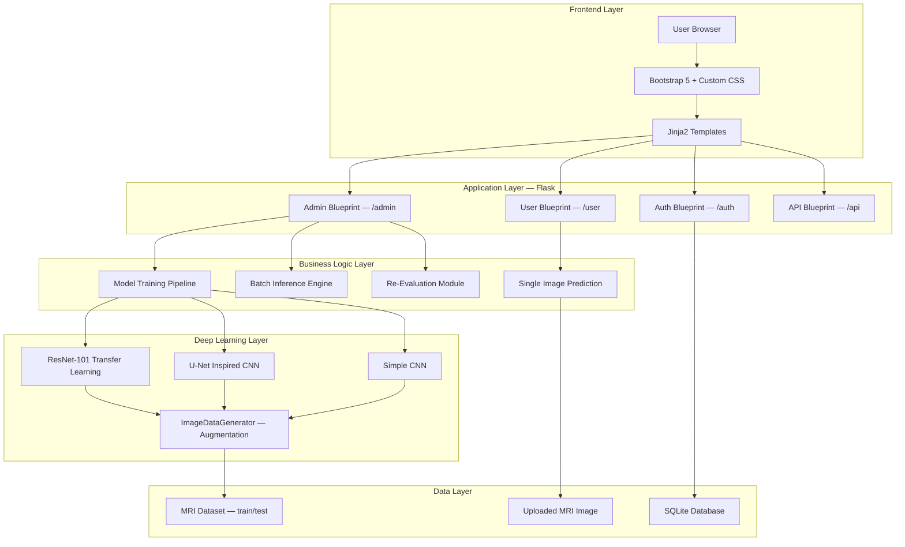

# Alzheimer Disease Prediction System Using MRI Brain Scans

> 🎓 **Final Year Major Project**  
> *A Healthcare 5.0 Integration of Internet of Medical Things (IoMT) and Deep Learning*

---

## 🌐 Live Deployment
**Live Demo:** [https://alzheimer-disease-prediction-xm6y.onrender.com](https://alzheimer-disease-prediction-xm6y.onrender.com)  
*(Deployed on Render Free Cloud Services with optimized TensorFlow Lite inference engines)*

---

## 📌 Project Overview
This project presents an end-to-end medical AI application that automates the early-stage detection of Alzheimer's Disease from MRI brain scan images. Using deep learning models, the system classifies brain scans into four distinct categories:
1. **Non-Demented**
2. **Very Mild Demented**
3. **Mild Demented**
4. **Moderate Demented**

It provides a dual-portal interface:
- **Clinician/User Portal:** Enables medical personnel to upload MRI scans, visualize prediction probability distributions, track prediction history, and view statistical charts.
- **Admin/Research Portal:** Provides research capabilities to train new models (ResNet-101, U-Net, Custom CNN), compare performance metrics (Accuracy, Precision, Recall, F1-Score), run batch testing, and view live training logs.

---

## ⚙️ Core System Features
- **Real-Time Automated Diagnosis:** Users upload an MRI scan (JPG/PNG/BMP) and receive instant predictions with class-by-class probability scores and processing latency.
- **Tri-Model Deep Learning Pipeline:** Supports three deep learning architectures for model training and comparison:
  - **ResNet-101 Transfer Learning:** Leverages ImageNet pre-trained weights for feature extraction.
  - **U-Net Inspired CNN:** Custom architecture tailored for segmentation-like feature detection.
  - **Custom CNN:** A balanced, 4-class Convolutional Neural Network.
- **Admin Control Panel:** Admins can configure training hyperparameters (epochs, learning rate, batch size) and activate/deactivate models dynamically.
- **Performance Reports:** Compares model performance with visual analytics, including dynamic confusion matrices and classification metrics.
- **Production Optimization:** Configured with lazy-loaded dependencies and a lightweight **TensorFlow Lite (.tflite)** inference engine to ensure optimal runtime efficiency and memory stability in production environments.

---

## 🛠️ Tech Stack & Technologies
| Category | Technologies Used |
| :--- | :--- |
| **Backend Framework** | Python 3.12, Flask 2.3+, Flask-SQLAlchemy, Flask-Session |
| **Deep Learning Engine** | TensorFlow 2.16+, Keras 3.0+, TensorFlow Lite |
| **Image Processing** | OpenCV 4.8+, Pillow 10.0+ |
| **Data Science / Stats** | NumPy, Pandas, scikit-learn, Matplotlib |
| **Database** | SQLite (via SQLAlchemy ORM with 8 tracked models) |
| **Frontend UI/UX** | HTML5, Vanilla CSS3 (Custom Dark Mode Design System), Bootstrap 5, JavaScript (AJAX) |
| **Authentication** | Werkzeug Secure Hashing (PBKDF2-SHA256) |
| **Deployment Server** | Gunicorn (WSGI Server), Render Cloud Services |

---

## 📐 System Architecture


---

## 🚀 Local Installation & Setup

Follow these steps to run the project locally on your machine:

### 1. Clone the Repository
```bash
git clone https://github.com/AhmedHussain-56/Alzheimer-Disease-Prediction.git
cd Alzheimer-Disease-Prediction
```

### 2. Set Up Virtual Environment
```bash
python -m venv venv
# On Windows
venv\Scripts\activate
# On Linux/macOS
source venv/bin/activate
```

### 3. Install Dependencies
```bash
pip install -r requirements.txt
```

### 4. Initialize Database and Users
Run the setup script to generate SQLite database tables and seed the initial users:
```bash
python setup.py
```
This registers:
- **Default Admin Account:** Username: `admin` | Password: `admin123`
- **Default Clinician/User Account:** Username: `demo` | Password: `demo123`
*(Make sure to change default passwords in production settings)*

### 5. Run the Application
```bash
python run.py
```
Open [http://localhost:5000](http://localhost:5000) in your web browser.

---

## 📦 Cloud Production Details
To ensure the app operates safely within Render's free tier (512MB RAM):
- The model files (`.h5`) are converted to TensorFlow Lite (`.tflite`) format (stored in `saved_models/`).
- The application implements **lazy imports** of the heavy TensorFlow library, ensuring it does not load during Flask/Gunicorn startup.
- The web app runs predictions using `tflite-runtime` or the `tensorflow.lite` interpreter, maintaining server RAM usage under **80MB** (saving >80% RAM compared to full Keras models).
